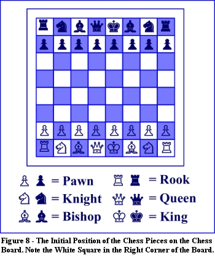

###########################
LET's PLAY CHESS
###########################

Origin of this game is not certain; some say it originated from India, while
others claim that it is from China.  What we have today it is evolved form from
its original. Also, more than winning **‘Winning with Style’** was the concern. 
Tournaments of game started since second half of 19th century. This is a very
basic introduction of this game. 

OBJECTIVE
=============

The objective of the game is to trap the opponent's king so that its escape is
not possible (checkmate). If a player's king is threatened with capture, it is
said to be in check, and the player must remove the threat of capture on the 
next move. If this cannot be done, the king is said to be in checkmate.
(Wikipedia)

BOARD
====================

- Divided into 64 boxes , 8x8 matrix. 64 boxes altogether, each called house.

From Left to right:

**Vertical Lines :** Called as files, normally labeled a through h.
**Horizontal Rows :** Called as ranks, numbered 1 to 8.

PIECES:
====================

Altogether this game contains six types of pieces and all move differently.
**Pawn (P):**   Moves forward 1 housebut capture diagonally. 
**Knight (N)**   Can move two and half house in all directions.
Behaves like a horse and can jump over other pieces. 
**Bishop (B)**  Can move only in diagonal direction and a move as far it wants. 
**Rook (R)**   Moves to any square left right, back and front but straight as far needed.
**Queen (Q)**   Most powerful piece on board. It can an move one straight
direction (horizontally, vertically, sides or diagonally).
**King (K)** Can move one square in all directions unless house occupied by a 
friendly piece or the move would reult in check.

BOARD SETTING:
====================

| Pieces are arranged the same way all the time.
| Second row is filled with pawns.The rooks sit in the corners in first row, thenthe knights next to them, next to them are the bishops, and finally the queen goes on her own matching color (white queen on white, black queen on black), and the king on the remaining square.
| The player with the WHITE pieces always moves first. 
| It is better to move to think 6 to 7 moves ahead about what a piece can do.This is same as forecasting the future events and planning accordingly. 

ILLEGAL MOVES 
================================

Game might have illegal moves , llegal move is  not permitted by the rules of
chess. If discovered during the course of a game must be corrected, following
the rules depending on scenario.

IRREGULARITIES:
================================

Game might also have irregularities and need to be corrected for example, if
discovered during the game that the starting position was incorrect, the game
is restarted. Method to correct the irregularity depends on the scenario and
different scenarios have predefined rules.

TECHNICAL:
================================

Sometechnical words are linked to different scenarios of game such as:

**- Lone King:**  When king is the only left piece. 

**-Check:** Condition when a player's king is under threat of capture on their
opponent's next turn.

**-Checkmate:**  Position in which a player's king is in check 

**-Touch-Move:** If a player touches any of its own pieces must move that, tied 
to condition of being a legal move. If a player touches an opponent’s piece,
must capture that piece. In case if touched because wanted to adjust a piece
must convey their idea usually just by saying *“adjust”*.
 

In addition to the basic moves there are certain moves and techniques linked to
the pieces, such as:

**-Castling:** Combining with rook, king may make this special move. Allowed when
neither rook or kings moved prior, and so on.

TOURNAMENTS:
================================

Fédération Internationale des Échecs(FIDE)  or World Chess Federation is an 
international organization responsible to connect national chess federations 
around the world. FIDE not only organizes the tournaments but these tournaments
follow the FIDE rule handbook. 
Most competitive individual tournaments include Linares chess tournaments and
the Tata Steel chess tournament. The largest team chess tournament is the Chess
Olympiad and payers compete for national team. Chess Computer have even entered
in tournament scenarios. Tournaments have their way of scoring based on 
loose/win and draw. Likewise these games are timed and different types of time
controls are available. Likewise, different rules available for timing related
issues and moves. 

BENEFITS:
================================

Even though we are always doing something online but still the old ways are
still needed to keep your brain active and powerful.  It can be reading, having
an outdoor activity, math games or something else. It seems like playing chess
is sitting idle but with itself this has its own benefits. Playing CHESS is one
of them. Chess requires a lot of brain activity and being focus it can help
Alzheimer patients to improve their brains. It helps to improve imagination and
creativity as well as memory capability. As it helps to develop focus so does
improve reading ability. 

READY TO PLAY:
================================

In addition to above described rules and terms there are other additional rules
applicable to this game and available through online resources/libraries/books
available in market. Now a day’s easy to play as can be played for, a lot of 
free material available online and so many free softwares are available. Even
if you do not have a partner can be played with machines. 

Here is the rule book: 
.. https://www.fide.com/component/handbook/?id=124&view=article

**References**
==================
http://www.wholesalechess.com/news/1111/5-brain-boosts-from-playing-chess.html
http://en.wikipedia.org/wiki/Rules_of_chess
http://chess.math.com/
http://www.il-chess.org/index.php/guide-to-scholastic-tournaments
http://www.chessteachers.org/Rules%20of%20Chess.htm
http://en.wikipedia.org/wiki/Rules_of_chess#Timing
http://www.chess.com/learn-how-to-play-chess
http://en.wikipedia.org/wiki/FIDE
http://www-math.bgsu.edu/~zirbel/chess/BasicChessRules.pdf